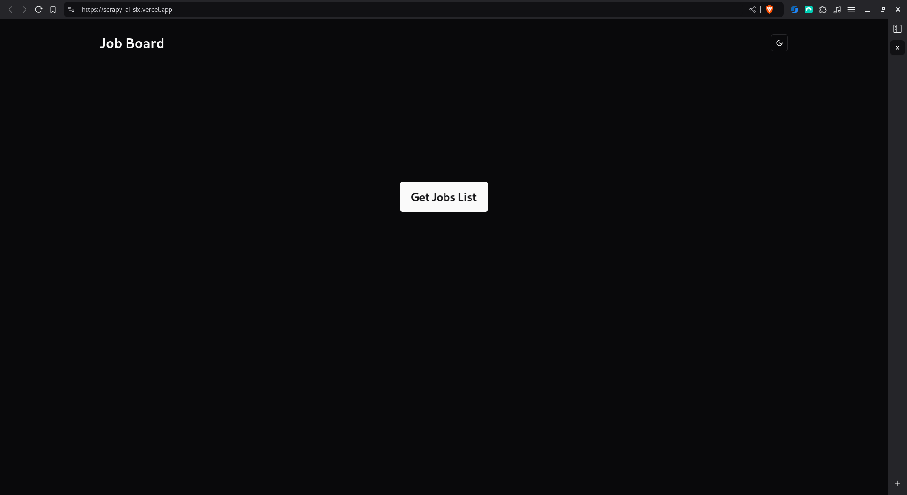
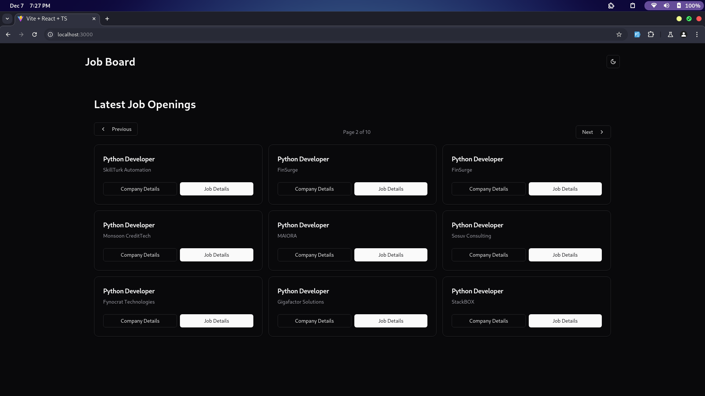
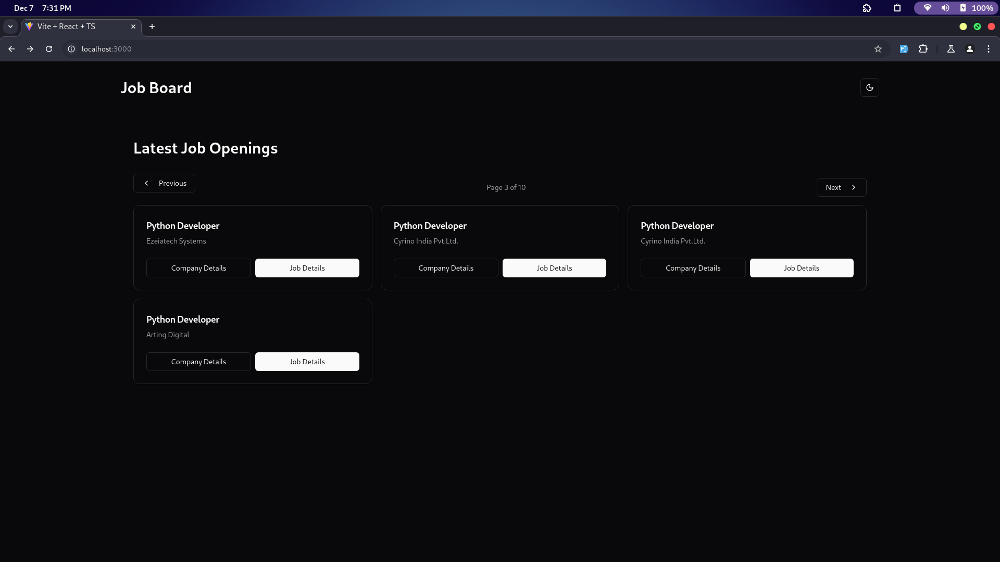
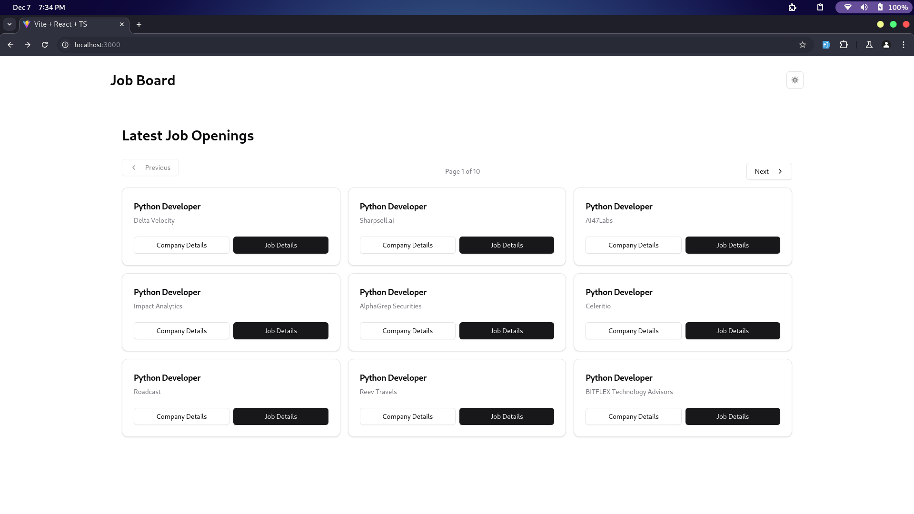

# **Scrapy the Scraper**  

A full-stack web application that allows users to scrape job listings for **Python Developer** roles from Wellfound (formerly AngelList). The app is built with **React** for the frontend, **FastAPI** for the backend REST API, and **Playwright** for the web scraping logic.  

---

## 🚀 **Features**  
- **Scrape Jobs in Real-Time**: Click a button to trigger the scraping of Python Developer jobs.  
- **Company & Job Title Display**: View a list of companies hiring for Python Developer roles, along with job titles and other key details.  
- **Interactive UI**: A simple button to trigger the scraping process and display the results.  
- **Dynamic Data Fetching**: Real-time updates from the backend to the frontend.  

---

## 🛠️ **Tech Stack**  
### **Frontend**  
- **React** (with Vite) — For building a fast, interactive user interface.  
- **Axios and React-query** — For making API requests to the FastAPI backend.  
- **Tailwind CSS and Shadcn** — For simple, clean UI styling (if applicable).  

### **Backend**  
- **FastAPI** — For building a lightweight REST API.  
- **Playwright** — For powerful browser automation and scraping logic.  

### **Other Tools**  
- **GitHub** — For version control.  
- **Deployment** — Vercel for the frontend and Render for the backend.  

---

## 📷 **Screenshots**  

<div style="display:grid,grid-cols:3">




</div>


---

## 🔧 **Setup Instructions**  

### **1️⃣ Prerequisites**  
Make sure you have the following installed:  
- **Node.js** (for running the React frontend)  
- **Python 3.10+** (for running the FastAPI backend)  
- **Playwright dependencies** (these are platform-dependent, but typically `pip install playwright` handles it)  


### **2️⃣ Clone the Repository**  
```bash
git clone https://github.com/Prathamdas3/scrapy_the_scraper.git
cd scrapy_the_scraper
```


### **3️⃣ Install Dependencies**
**Frontend**
```bash
cd client
npm install 
or 
pnpm install
or 
bun install
```

**Backend**
```bash
cd server
pip install -r requirements.txt
playwright install
```

### **4️⃣ Environment Variables**
**Frontend**
create a `.env` file in the `client` directory and add the following (example):

```txt
VITE_BASE_URL=http://localhost:8000
```

**Backend**
create a `.env` file in the `server` directory and add the following (example):
```c
BASE_URL= // add your wellfound url to scrape
PROXY=// add your proxy with port
PROXY_USER_NAME=// add user name for the proxy you are using
PROXY_USER_PASSWORD=//add your password for the proxy 
FRONTEND_URL=https://localhost:3000 // remove this with your deployed frontend url for deployment
```
### **5️⃣ Run the Application**
**Run the backend**
```bash
cd server
uvicorn main:app --reload
or 
python main.py
```

**Run the Frontend**
```bash
cd client
npm run dev 
or 
pnpm run dev
or 
bun run dev
```

Once everything is running, visit http://localhost:3000 to see the app in action 

---


### **📘 API Endpoints**
- `GET /:page`: Start the Scraping for that page with pagination
- `GET /get_data`: Fetch the Scraped data
- `GET /`: To check if the server is running or not

#### Sample Request
**Endpoint**: `/1`:
**Method**: `GET`

#### Sample Response
```json
{"content": "Process Started", "status": 200}
```

---

### **🕵️ How the Scraper Works**

1. **User Clicks the Button:** The user clicks a button on the frontend to trigger the job scraping process.
2. **FastAPI Receives Request:** The React app sends a GET request to the FastAPI backend.
3. **Playwright Scrapes Data:** The FastAPI backend triggers the Playwright script to search for "Python Developer" job listings on Wellfound.
4. **Data is Processed:** The scraping logic extracts job titles, company names, and other details.
5. **Data is Sent to the Frontend:** The backend sends the scraped data back to the frontend, where it is displayed in a clean, interactive layout.

---

### **📚 Project Challenges & Solutions**

1. **CAPTCHA** and **Proxy Issues**

   - **Problem:** Encountered CAPTCHA and proxy restrictions during scraping.
   - **Solution:** Used Playwright’s stealth mode, tried rotating proxies, and documented the limitations for future enhancements.
2. **Limited Resources** on **Free Deployment Plans**

   - **Problem:** Limited memory and CPU in the free hosting tier caused scraping to fail.
   - **Solution:** Added documentation on how to run the project locally for optimal performance.

---
### **🚀 Deployment**
- The project is live at: **[Live Demo](https://scrapy-ai-six.vercel.app/)**

> **Note:** Due to the resource limitations of the free hosting plan (limited CPU and memory), the scraping process may not work as expected. For the best experience, please run the project locally by following the **Setup Instructions** section.  


- **Running Locally**  
If you'd like to experience the project without the hosting limitations, you can run it locally with the following steps:  
    1. Clone the repository.  
    2. Install dependencies for both **frontend** and **backend**.  
    3. Run the backend and frontend servers locally.  

    More details are provided in the **Setup Instructions** section.  

--- 

### **📋 Possible Enhancements**

- **Use Third-Party CAPTCHA Solvers:** Services like 2Captcha can bypass CAPTCHA checks.
- **Cloud Scraping:** Use a paid cloud service with higher CPU and memory to support scraping.
- **Scraper Optimization:** Implement browser fingerprinting techniques to avoid being blocked.
  
---

### **📜 License**

This project is licensed under the MIT License. See the `LICENSE` file for more details.